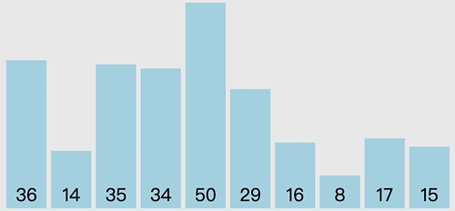
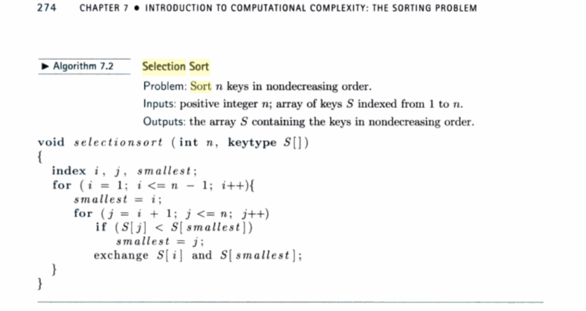

# 选择排序(Selection sort)

- 时间复杂度：均是 O(n²)
- 稳定性：不稳定

## 算法步骤

- 首先在未排序队列中找到最小(大)元素，存放到排序序列的起始位置
- 再从剩余未排序元素中继续寻找最小(大)元素，然后放到已排序队列末尾
- 重复第二步，直到所有元素均排序完成

## 动图演示



## 代码

- 伪代码

  

- js

  ```js
    function selectionsort (arr) {
      let i, j, smallest, tmp;
      const { length } = arr; 
      for (i = 0; i < length - 1; i++) {
        smallest = i;
        for (j = i + 1; j < length; j++) {
          if (arr[smallest] > arr[j]) {
            smallest = j;
          }
        }
        if (smallest !== i) {
          tmp = arr[smallest];
          arr[smallest] = arr[i];
          arr[i] = tmp;
        }
      }
      return arr;
    }
  ```

## 性能分析

### 时间复杂度

- 交换次数：0 ~ n-1
  - 0：正序数列
  - n-1：反序数列

- 总赋值次数：`n-1 ~ (n+8)*(n-1)/2 = 0 + n-1 ~ (n-1)*4 + (n-1)+(n-2)+...+1`
  - 时间复杂度为：O(n) ~ O(n²)
- 比较次数：`(n + 2) * (n - 1) / 2 = (n - 1 + 1 + 2) * (n - 1) / 2 = (n - 1) + (n - 2) +··· + 1 + n - 1`
  - 时间复杂度为：O(n²)

- 交换次数比冒泡排序少多了，由于交换所需CPU时间比比较所需的CPU时间多，n值较小时，选择排序比冒泡排序快

### 稳定性

如果一个元素比当前元素小，而该小的元素又出现在一个和当前元素相等的元素后面，那么交换后稳定性就被破坏了。所以选择排序是一个不稳定的排序算法。

- 如：`5 8 5 2 9`
