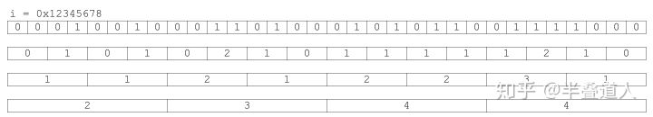

# 二进制位运算

## 异或

### 法则

1. 归零律：$$ a \bigoplus a = 0 $$
2. 恒等律：$$ a \bigoplus 0 = a $$
3. 交换律：$$ a \bigoplus b = b \bigoplus a $$
4. 结合律：$$ a \bigoplus (b \bigoplus c) = (a \bigoplus b) \bigoplus c $$
5. 自反：$$ a \bigoplus b \bigoplus a = b $$

### 特点

1. 异或的运算法则和加法的不带进位相同，常被认作不进位加法

### 运用

1. 自反，交换两个数

```js
  swap(a, b) {
    a = a ^ b;
    b = b ^ a;
    a = a ^ b;
  }
```

## 应用

- 数字中 `1` 的个数
  - 遍历
    - `n & (n - 1)` - 设置最低位上的 `1` 为 0

    ```js
      function getOneCount(n) {
        let count = 0;
        while(n) {
          n = n & (n - 1);
          count++;
        }

        return count;
      }
    ```

  - 查表
    - bits[n] = bits[n>>1] + (n & 1)

    ```js
      // 将数组中的数字按照 1 的个数排序，相同则按照大小排序（数字最大10001）
      function oneCountSort(arr) {
        const bits = [];
        bits[0] = 0;
        for (let i = 1; i < 10001; i++) {
          bits[i] = bits[i>>1] + (i & 1);
        }
        arr.sort((a, b) => bits[a] === bits[b] ? a - b : bits[a] - bits[b]);

        return arr;
      }
    ```

  - swar 算法

    ```js
      function swar(n) {
        n = (n & 0x55555555) + ((n >> 1) & 0x55555555);
        n = (n & 0x33333333) + ((n >> 2) & 0x33333333);
        n = (n & 0x0f0f0f0f) + ((n >> 4) & 0x0f0f0f0f);
        n = (n * 0x01010101)>>24;

        return n;
      }
    ```

- 位运算实现加法

  - 将 a + b 转化为无进位的两个数之和
  - a + b = (a ^ b) + ((a & b) >> 1)
  - 当 a & b = 0 时，a + b = a ^ b

  ```js
  function add(a, b) {
    let xor;
    let add;
    while(xor = a ^ b, add = a & b) {
      a = xor;
      b = add << 1;
    }

    return xor;
  }
  ```

### Variable Precision Swar 算法

> 数字中 `1` 的个数

- 算法的核心，在于用最高的 `8` 位放置二进制位中 `1` 的个数
- 二进制位中 `1` 的个数，每位数字{0|1}相加
- 1. 每 `2` 个二进制位分组
  - 低位和高位的和 为 `2` 个二进制位中 `1` 的个数
- 2. 每 `4` 个二进制位分组
  - 低 `2` 位和高 `2` 位的和 为 `4` 个二进制位中 `1` 的个数
- 3. 每 `8` 个二进制位分组
  - 低 `4` 位和高 `4` 位的和 为 `8` 个二进制位中 `1` 的个数
- 4. 将 `32` 位数字的四部分(每部分 `8` 位)累加
  - `高 8 位` + `高中 8 位` + `低中 8 位` + `低 8 位` =
  - $ i + (i << 8) + (i << 16) + (i << 24) $
  - $ i * (1 + (1 << 8) + (1 << 16) + (1 << 24)) $
  - $ i * 0x01010101 $
- 5. 再左移 `24` 位得到高 `8` 位


